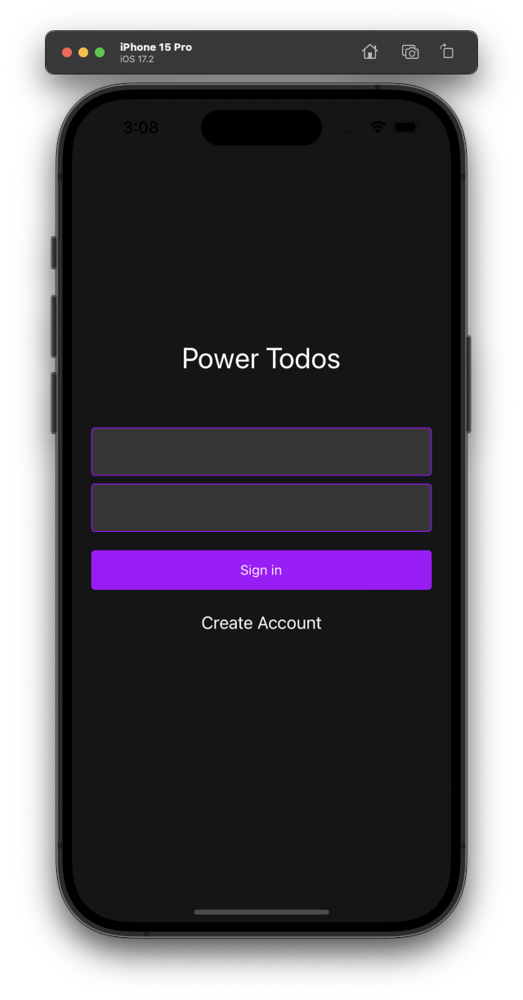
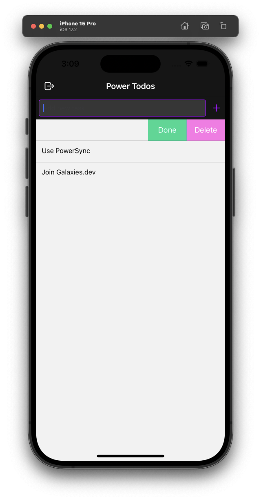
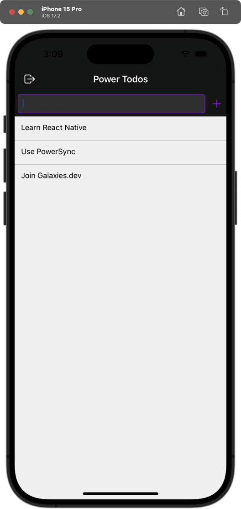

# React Native Local-First App with PowerSync and Supabase

This is a React Native Local-First App using [PowerSync](https://www.powersync.com/) and [Supabase](https://supabase.io/).

## Installation

1. Clone the repository
2. Run `npm install` to install the dependencies
3. Create a Supabase account and a new project
4. Create a new table using the `supabase.sql` file
5. Create a new PowerSync account and [connect PowerSync to your Supabase project](https://docs.powersync.com/integration-guides/supabase-+-powersync#connect-powersync-to-your-supabase)
6. Add the `sync-rules.yaml` file to your PowerSync project
7. Update the `.env` file with your Supabase URL and API Key, and the PowerSync URL
8. Run the app using `npx expo run:ios` or `npx expo run:android`

## Screenshots

## Demo

